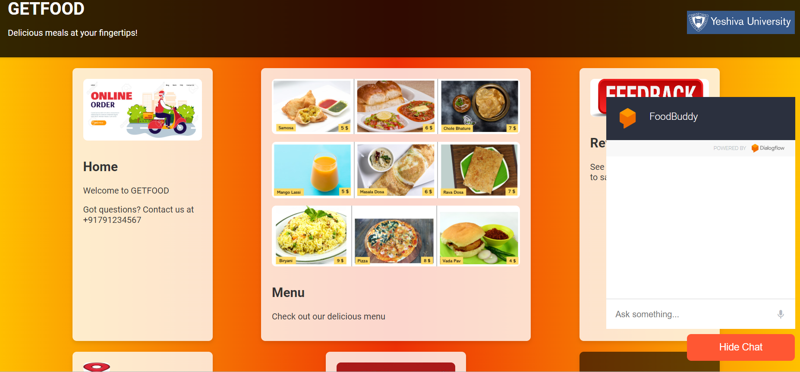
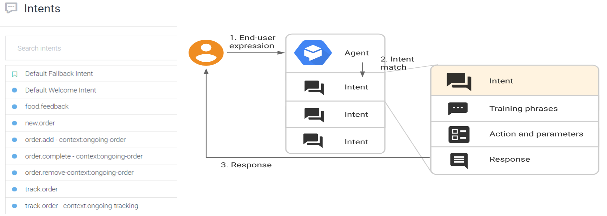
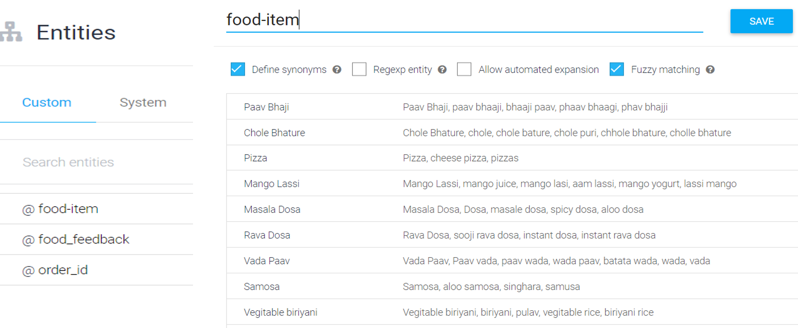

[Project Webpage Link](https://bhadra24.github.io/)

# Restaurant-Based Chatbot And Text Summarization Using Dialog Flow 
<div align="center">
    <a></a>
</div>

## Table of Contents

- [Restaurant-Based Chatbot And Text Summarization Using Dialog Flow](#Restaurant-Based-Chatbot-And-Text-Summarization-Using-Dialog-Flow)
  - [Table of Contents](#table-of-contents)
  - [Introduction](#introduction)
      - [Project Description](#project-description)
      - [Website](#website-screenshots)
  - [Dataset Preparation ](#dataset-preparation)
      - [Intent Images](#intent-images)
      - [Entities Images](#entities-images)
  - [Method](#method)
  - [Implementation](#implementation)
  - [Results](#results)
  - [Technical Information](#technical-information)
  - [Benefits](#benefits)
  - [Applications](#applications)
  - [Citations](#citations)
   
## Introduction

### Project Description

This project introduces a Restaurant Bot, a proof-of-concept powered by Dialog Flow. With advanced natural language processing capabilities, it allows users to effortlessly place food orders, track their status, assist customers by answering FAQs, make table reservations, provide menu details, and accommodate special requests. 

The project is divided into two main parts:
- **Part 1:** Create a restaurant bot using Dialog Flow.
- **Part 2:** Generate text summarization from the bot and user. This summary is then used to conduct sentiment analysis, helping the restaurant owner enhance customer satisfaction and drive business growth..

### Website Screenshots

<figure align="center"> 
  
  <figcaption>Screen to Facilitate Course Addition</figcaption>
</figure>

<figure align="center"> 
  
  <figcaption>Screen to Capture Course Attendance</figcaption>
</figure>

<figure align="center"> 
  
  <figcaption>Screen to Modify, Save or Download Attendance CSV.</figcaption>
</figure>


## Dataset Preparation:
**1. Teaching the Chatbot Our Language:** We define user goals (intents) like "View Menu" and provide examples of how users might ask for them. The variety and quality of these examples directly impact the chatbot's understanding.

**2. Extracting Key Details:** We identify important information users might provide (entities) like "number of guests" or "reservation time." Defining entities helps the chatbot pinpoint these details within user queries.

**3. Connecting the Chatbot to the Back-End (Fulfillment):** For dynamic responses or actions (e.g., checking availability), we'll use APIs (built with FASTAPI) to connect the chatbot to our systems, allowing it to retrieve information or complete tasks based on user interactions

### Intent Images:
<figure align="center"> 
  
  <figcaption>Generated Intents</figcaption>
</figure>

### Entities Images:
<figure align="center"> 
  
  <figcaption>Entities</figcaption>
</figure>

## Method:


## Implementation:
Create a folder named chatbot (any name you like) then navigate to that folder using the anaconda prompt and create an environment.
```bash
conda create --name chatbot python

conda create --name chatbot python=3.8   (can specify the python version if required)
```
Activate the environment
```bash
conda activate chatbot
```

To Run the File while developing
1. Run below command to start FastAPI
```bash
uvicorn main:app --reload
```
2. Download the ngrok.exe from ngrok page or go to https://dashboard.ngrok.com/get-started/setup/windows.This setup page and follow the steps for download as per your os/programming requirements
```bash
choco install ngrok
ngrok config add-authtoken 2eeSxTGVimejOxtIM4hUBusdDnd_75rZxYpbn5F3eGuG6cqXm
```
3. Run below command to start the server
```bash
ngrok http http://localhost:8000  or ngrok http 8000  (in cmd prompt)
```
4. Copy the URL provided by the server and paste it into the fulfillment webhook URL of Dialogflow
```bash
https://69a4-2607-fb91-309b-5ed-1d1a-be1d-3d37-c09b.ngrok-free.app  (example)
```


## Results:


## Demo:
https://github.com/YoushanZhang/AiAI/assets/62828547/ca918506-9f5e-435f-9b19-e51496da88b8


## Technical Information:

- **Programming Language**: Python.
- **Cloud Service**: Google Dialog Flow.
- **Website scripting languages**: HTML , CSS, Javascript.
- **API framework**: Fast API.
- **Coding Environment**: VS Code.
- **Database**: Mysql for restaurant data, MongoDB for Chat data.


## Benefits:

- **Empowered Customers**: Chatbots can answer questions, generate reports, and offer personalized recommendations based on customer needs.
- **Data-Driven Insights**: Summarized reports on customer interactions to identify product demand and common pain points.
- **Enhanced Convenience**: Provides a faster and more user-friendly approach for everyone.

## Applications:

- **Sales Projections**: Utilize a chatbot to assess sales projections for the upcoming quarter, compare them against the budget, and pinpoint areas for improvement.
- **Summarized Reports**: Summarized reports reveal frequently asked questions, highlighting areas for product development or improved communication.
- **Customer Sentiments**: Sentiment analysis combined with slow resolution times can indicate frustrated customers, prompting a focus on faster issue resolution.

## Citations:
1. [RetinaFace](https://arxiv.org/abs/1905.00641)
2. [Title Image](https://www.google.com/url?sa=i&url=https%3A%2F%2Fwww.timedynamo.com%2Fblog%2Fface-recognition-attendance-system&psig=AOvVaw2FkF7iZtn_xnR0WqiLOgx8&ust=1713675455940000&source=images&cd=vfe&opi=89978449&ved=0CBIQjRxqFwoTCMjdmdmA0IUDFQAAAAAdAAAAABAS)

